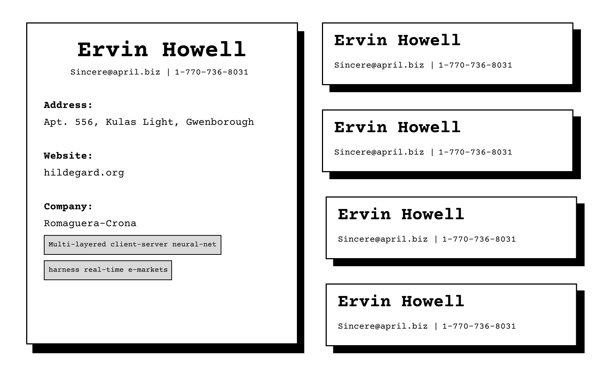

# User Contacts Display - ReactJS Project



This is a simple ReactJS project that fetches and displays user contact information from JSONPlaceholder. JSONPlaceholder is a free online REST API that provides placeholder data for testing and prototyping.

## Features

- Fetch user contact information from an external API.
- Display user details including name, email, phone, and website.
- Simple and clean UI.

## Demo

You can see a live demo of the project via AWS Amplify Deployment here https://main.dt48jq760eddo.amplifyapp.com.

## Installation

To run this project locally, follow these steps:

1) Clone the repository:

```bash
git clone https://github.com/SonPhatTranDeveloper/user-contact-list
```

2) Navigate to the project directory:

```bash
cd user-contacts-list
```

3) Install the dependencies:

```bash
npm install
```

4) Start the development server:

```bash
npm start
```

The app will be available at http://localhost:3000.

## Project Structure

```
user-contact-list/
├── public/
│   ├── index.html
│   └── ...
├── src/
│   ├── components/
│   │   ├── Card.js
│   │   └── ...
│   ├── App.js
│   ├── index.js
│   └── ...
├── .gitignore
├── package.json
└── README.md
```

- ```public/```: Contains the HTML file to render the React application.
- ```src/```: Contains the React components and main application logic.
- ```components/```: Contains the UserCard component to display individual user details.
- ```App.js```: Main component that fetches user data and renders the UserCard components.
- ```index.js```: Entry point of the React application.

## Usage

After starting the development server, open your browser and go to http://localhost:3000.
The application will automatically fetch user data from JSONPlaceholder and display the contact information.

## API

The application fetches data from the following endpoint:

- GET https://jsonplaceholder.typicode.com/users: Returns a list of users.

## Contributing

Contributions are welcome! If you have any ideas, suggestions, or bug reports, feel free to open an issue or submit a pull request.


